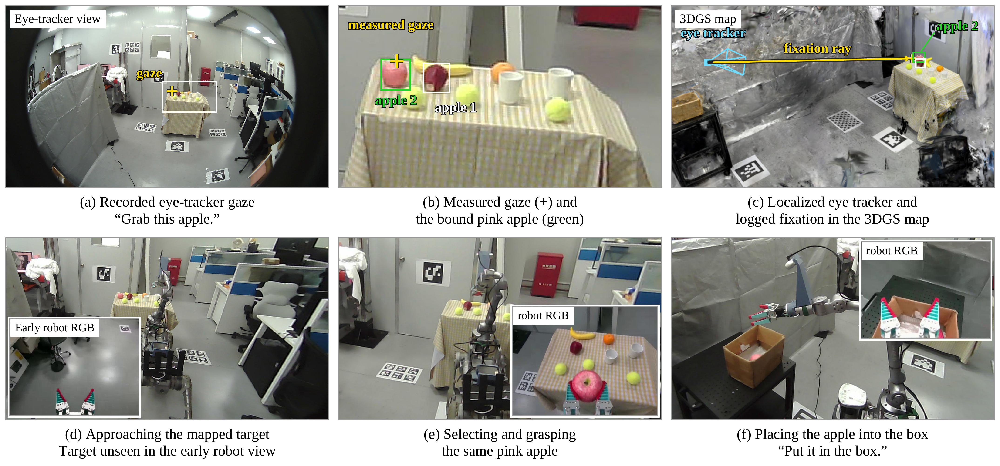

# 实验

我们通过两类实验评估 GazeSplat：E1检验系统能否将用户注视解析为正确的地图实例，并分析锥形投票在其中的作用；E2检验解析出的实例能否驱动机器人完成导航、抓取和递送或放置。实验重点考察相邻物体的区分、用户走动时的目标解析，以及机器人初始看不到目标时的任务执行。

## 1. 实验设置

实验平台由Pupil Core眼动仪、无线麦克风，以及配备Z1机械臂和RealSense相机的Unitree B2四足机器人组成。眼动定位、注视解析、语音识别和指令解析在Linux工作站上运行，机器人导航、目标重新观测和机械臂控制在机载计算机上运行。3DGS建图训练与离线回放使用独立的RTX 4090工作站。

实验场景包含多种桌面布局，每种布局分别建图并注册任务物体。目标包括三个外观相同的网球、两个同款白色杯子，以及苹果、香蕉、橘子等日常物品。通过改变物体布局、观察距离和观察方向，形成不同的目标角间距与部分遮挡条件。任务物体不附加识别标记；环境中的标记仅用于建立和访问用户与机器人共享的坐标系。

共有六位成员参与眼动数据采集。Pupil Core采用屏幕中心和四角的五点校准，观测到的校准误差约为\(1^\circ\)。据此，主配置固定使用\(\sigma=1^\circ\)，并通过离线回放分析不同锥宽的影响。E1评价接收阈值筛选前的实例选择结果，E2使用完整在线绑定与执行流程。在线接收参数保持固定：最低归一化得分为0.2，票面份额不低于0.45；份额介于0.35与0.45时，还须达到第二候选的1.4倍。

## 2. E1：注视目标识别

### 实验流程与评价指标

参与者按照随机生成的顺序卡依次注视目标。球卡使用三个网球实例，每张卡包含15次注视，每个实例出现五次；综合卡包含网球、杯子和水果等多种物体，例如九个物体组成的12项注视序列。站定试验覆盖不同距离下的正面与斜向观察，行走试验要求参与者在前后或左右移动的同时完成注视序列。

每个预设目标对应的注视时段作为一次试验，顺序卡中的实例身份作为预期目标。对于归入该时段的物体注视事件，分别累加各实例的事件持续时间，取累计时长最长的实例作为预测。预测与预期目标一致记为正确，选错目标或在有效时段内没有物体输出均记为失败。准确率为正确试次数占有效试验总数的比例。所有比较方法回放相同的录制数据，并采用相同的目标时段与判分规则。

我们用最小角间距\(\theta\)描述目标区分难度。它是从用户头位出发，目标质心方向与最近干扰物质心方向之间的夹角。每次试验根据该时段内的代表头位和地图几何分别计算\(\theta\)，其中代表头位取定位样本的逐分量中位数。因此，行走数据按每次注视的代表性角间距分组。

### 目标间距与行走条件下的结果

【插入最终角间距曲线；图中标明各分箱的正确数和试次数。】

当\(\theta\geq2.5^\circ\)时，系统正确识别132/139个目标，准确率为95.0%；当\(1^\circ\leq\theta<2.5^\circ\)时，正确识别92/103个目标，准确率为89.3%；当\(\theta<1^\circ\)时，准确率下降至64.8%。

结果表明，目标之间的角分离程度是影响实例识别表现的重要因素：间距较大时，注视邻域中的目标证据更容易区分；间距较小时，多个实例可能同时落入查询范围，目标选择更容易受到注视偏差和邻近物体的影响。

我们进一步根据地图几何标记目标是否被其他候选物体部分遮挡。该标签由目标方向上的表面采样得到，不使用注视预测结果，主要用于分析相邻物体对目标可见性的影响。遮挡组的结果作为角间距分析的补充，所用遮挡比例是几何采样指标。

在行走条件下，系统正确识别56/57个目标，准确率为98.2%。这些试验检验用户位置和观察方向持续变化时，系统能否仍将注视关联到地图中的指定实例。

## 3. 锥形投票的作用与参数分析

### 目标解析方法对照

为检验锥形投票的作用，我们比较四种目标解析方式。各方法使用相同的地图、录制输入和评价试次，区别在于如何利用注视附近的几何证据确定目标。

| 方法 | 目标解析方式 |
|---|---|
| 最近质心匹配 | 根据三维注视落点与实例质心的距离选择目标 |
| 空间球邻域投票 | 聚合三维注视点附近球形空间邻域中的实例证据 |
| 近似单射线查询 | 将查询锥收窄，仅保留中心方向附近的表面证据 |
| GazeSplat锥形投票 | 在注视方向周围聚合角度加权的渲染表面证据，并输出地图实例 |

| 方法 | 总体准确率（n=330） | \(\theta<1^\circ\)准确率（n=88） | 行走准确率（n=57） |
|---|---|---|---|
| 最近质心匹配 | 68.2%（225/330） | 21.6%（19/88） | 89.5%（51/57） |
| 空间球邻域投票 | 60.9%（201/330） | 22.7%（20/88） | 84.2%（48/57） |
| 近似单射线查询 | 41.5%（137/330） | 17.0%（15/88） | 28.1%（16/57） |
| GazeSplat锥形投票 | 85.2%（281/330） | 64.8%（57/88） | 98.2%（56/57） |

近似单射线与完整方法的对照检验扩大方向查询范围能否缓解中心射线偏离目标的问题。两者的总体准确率分别为41.5%和85.2%。结合不同角间距和行走条件下的结果，该比较用于确定方向不确定性建模在哪些条件下带来收益。

空间球邻域投票与最近质心匹配分别取得60.9%和68.2%。它们与锥形投票的比较检验采用用户视角下的方向加权表面证据，是否优于仅依据三维落点附近的空间距离进行目标选择。该对照评价以注视方向组织表面证据的整体查询策略。

### 查询锥宽度

固定其他配置后，我们改变\(\sigma\)，回放同一批数据，考察方向查询范围对目标识别的影响。默认值\(1^\circ\)根据校准误差量级确定，参数扫描用于分析这一选择的敏感性。

【插入\(\sigma\)参数曲线：横轴为锥宽，纵轴为准确率，分别展示不同\(\theta\)区间。】

已有回放结果呈现出查询范围过窄和过宽时表现下降的趋势。较窄的查询容易遗漏偏离中心方向的目标表面；较宽的查询则可能纳入更多邻近物体，使候选之间的竞争增强。因此，扩大查询范围存在收益与干扰之间的权衡，锥宽需要与观测误差的量级相匹配。

归一化、表面归属和候选集设置作为辅助消融简要报告。现有对照中，归一化与表面归属的部分变体取得接近的总体准确率，未在所有分组中显示一致优势。因此，本节主要依据查询策略和锥宽对照分析锥形投票的作用。

## 4. E2：真实机器人任务执行

### 任务流程与成功标准

E2评估用户指定的目标能否转化为机器人对正确实例的实际操作。任务包括抓取指定物体、将物体拿给用户，以及将物体放到指定位置。输入包含注视结合语音的指示性请求，以及直接输入物体名称的文字请求。前者覆盖注视绑定、语音解析和机器人执行，后者检验名称查询、地图目标定位与执行。

在注视与语音任务中，用户注视目标并发出指令，例如“把这个杯子拿给我”。系统根据指示词的时间戳检索相应注视事件，解析持久化实例，并将实例位置传递给机器人。机器人接近目标后重新观测场景，利用该空间参照选择对应物体，再完成抓取及后续动作。放置目的地可以由注册名称或另一段注视指定；递送给用户时，以确认时的用户位置作为目的地。

试验包含起点不作约束的条件A，以及机器人从任务房间外开始的条件B。条件B中的初始不可见案例用于检验：机器人尚未看到目标时，能否先根据用户注视和共享地图确定实例，再通过后续导航与重新观测完成操作。

每条任务按首次请求计分。只有目标解析正确，并完成指令要求的导航、抓取以及递送或放置，才记为成功。若开始时已选错目标，该次任务立即记为失败并终止。任务记录分别检查目标解析、到位、抓对和送达或放置，未执行的后续阶段不另算为一次独立试验。

### 执行结果与初始不可见案例

系统在38次任务中成功完成36次，首次请求成功率为94.7%。这一结果汇总两类输入方式。两次未完成任务均在注视目标解析阶段选错实例，因此在机器人执行前终止。

一条粉苹果任务展示了从用户注视到机器人操作的完整过程。用户注视物品台上的粉苹果并发出“Grab this apple”指令，系统将指代解析为地图中的粉苹果实例。机器人在接近初期尚未从自身相机中观察到目标，随后依据保存的目标空间参照接近物品台，在新的观测视角下选中并抓取该粉苹果。用户进一步发出“Put it in the box”指令后，机器人将苹果放入箱中。

图中同时展示眼动仪世界相机的完整视角、实测 gaze 的局部放大、地图中的眼动仪定位及注视射线，以及执行阶段的机器人 RGB 观测。该案例说明，在用户视角下确定的实例参照能够继续用于机器人后续不同视角下的目标选择，并支持目标在接近初期不在机器人视野内的操作任务。
